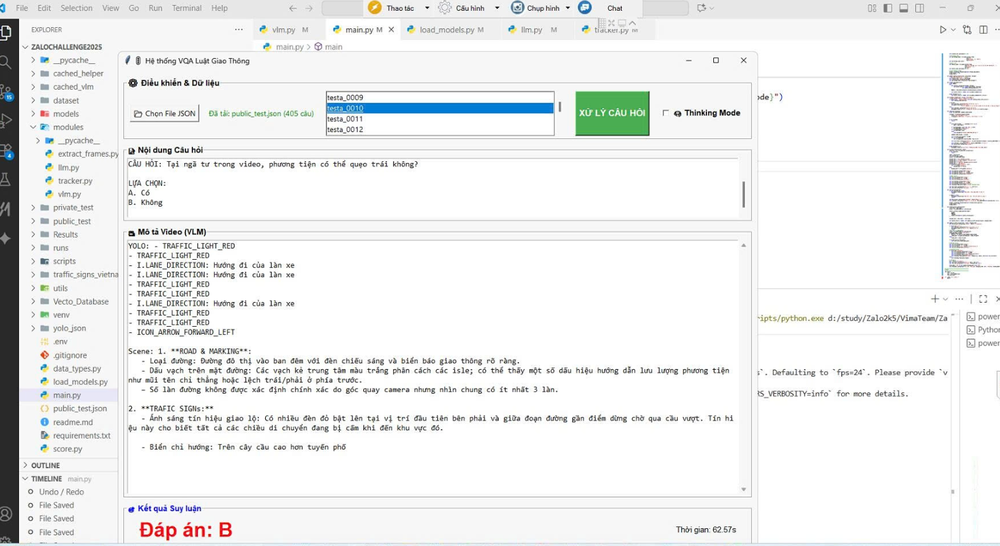
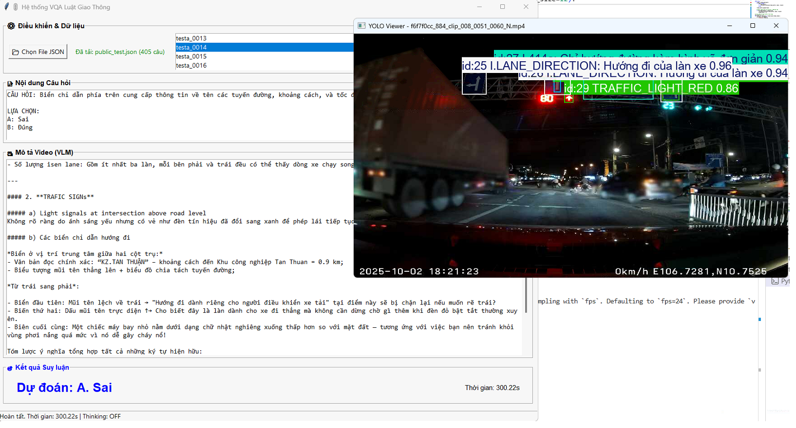
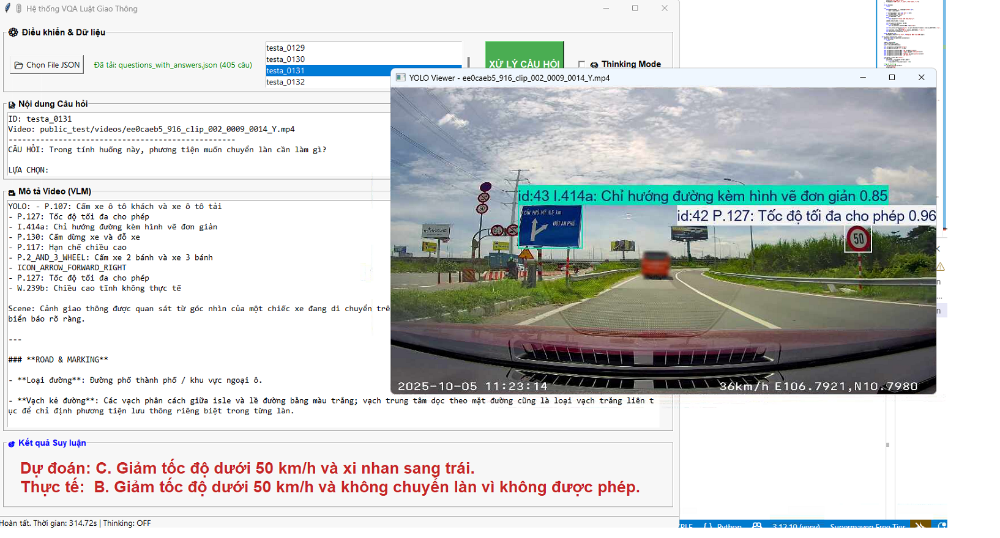

# ZALO AI CHALLENGE 2025

## Introduction
This project is developed as part of **ZALO AI CHALLENGE 2025**, with the goal of building a virtual assistant named **ROADBUDDY**.
The assistant is designed to answer user questions based on input data from dashcam videos.

According to the competition requirements:
- The system must operate **offline (no Internet connection)**.
- The **total number of model parameters must be under 8 billion**.
- The **response time for each question must be under 30 seconds**.

---

## Main Modules
- **Frame Extraction**: Preprocessing input video data.
- **Object Detection**: Detecting traffic-related objects such as traffic signs, traffic lights, lanes, etc.
- **VLM**: Generating context embeddings that capture the spatio-temporal information of the video to serve as input for the LLM.
- **Reasoning Core**: Performing logical reasoning based on Vietnamese traffic regulations to generate answers.

---

##  Technologies Used
- **Programming Language**: Python  
- **Main Libraries**:
  - PyTorch  
  - OpenCV  
  - NumPy  
- **Vision Model**: YOLOv12-S  
- **Vision-Language Model (VLM)**: Qwen3-4B-VL-Instruct  
- **Large Language Model (LLM)**: Qwen3-4B  
- **Platform**: Google Colab / Local Machine  

---

##  Main Features
- Traffic object detection from dashcam videos using **YOLOv12-S**
- Extraction of structured visual information (objects, positions, confidence scores)
- Utilization of **Qwen3-4B-VL-Instruct** to understand spatio-temporal context
- Use of **Qwen3-4B** as the reasoning core, combining visual information with user questions
- Generation of final answers in Vietnamese as required by the task
- Support for training, evaluation, and inference

---

##  Project Structure
```text
ZaloChallenge2025/
├── cached_frames/              # Cached frames for reuse
├── extracted_frames_for_test/  # Extracted frames for test set
├── models/                     # Model weights and checkpoints
├── modules/                    # Core modules (YOLO, VLM, LLM)
├── public_test/                # Public test data
├── scripts/                    # Data processing and pipeline scripts
├── train/                      # Training source code
├── utils/                      # Utility functions (cache, model download, frame processing)
│   ├── cached_helper.py
│   ├── download_models_npy.py
│   ├── download_models.py
│   └── SaveFrame.py
├── Vecto_Database/             # Vector database for contextual retrieval (RAG)
├── data_types.py               # Shared data type definitions
├── load_models.py              # Load YOLO, VLM, and LLM
├── main.py                     # Entry point of the pipeline
├── train.py                    # Training script
├── zaloChallenge2025.ipynb     # Experimentation and analysis notebook
├── requirements.txt            # Dependencies
├── README.md                   # Project documentation
└── .env                        # Environment variables
```
##  Installation and Usage
1. Clone Project
```
git clone https://github.com/username/zalo-challenge-project.git
cd zalo-challenge-project
```
2. Install dependencies
```
pip install -r requirements.txt
```
3. Train the model
```
python train.py
```
4. Download required models
```
python utils/download_models.py
```
5. Run the system
```
python main.py
```
##  Overall Architecture
```
Dashcam Video
   ↓
YOLOv12-S (Object Detection)
   ↓
Qwen3-4B-VL-Instruct (Visual / Video Context Understanding)
   ↓
Qwen3-4B (Reasoning & Answer Generation)
   ↓
Output (Answer)
```
##  Results
The system runs stably and meets the required processing speed constraints.
A complete end-to-end pipeline has been implemented, from object detection to reasoning and answer generation.
The current performance reaches approximately 0.5 on the public test set, serving as an initial baseline.
The performance can be further improved through fine-tuning and data optimization





## TrafficBuddy Dataset Structure
```
├── public_test/
│   ├── public_test.json
│   └── videos/
│       ├── video_1.mp4
│       ├── video_2.mp4
│       └── ...
├── train/
│   ├── train.json
│   └── videos/
│       ├── video_1.mp4
│       ├── video_2.mp4
│       └── ...
├── download_videos.py
```
## Limitations
The object detection model may still miss or misclassify objects in complex scenarios.
Dashcam video quality is not always stable
(motion blur, camera shake, high vehicle speed).
Challenging lighting conditions, especially at night, negatively affect detection accuracy.
Due to imperfect detection results, the input provided to the VLM may be unclear,
leading to occasional errors in reading and extracting text from traffic signs.
## Future Work
Retrain YOLOv12-S with a larger and more diverse dataset covering various lighting
conditions and real-world traffic scenarios.
Apply data augmentation techniques to improve robustness under blurry or noisy conditions.
Optimize the detection stage to provide clearer and more stable inputs for the VLM,
thereby improving contextual understanding and text extraction accuracy.
Explore fine-tuning strategies or alternative models to achieve a better balance
between accuracy and inference speed.
## Notes
- Due to competition regulations, the official public_test and train datasets
cannot be shared.
Below is an example of the JSON structure containing questions:
```
{
    "data": [
        {
            "id": "testa_0001",
            "question": "Theo trong video, nếu ô tô đi hướng chếch sang phải là hướng vào đường nào?",
            "choices": [
                "A. Không có thông tin",
                "B. Dầu Giây Long Thành",
                "C. Đường Đỗ Xuân Hợp",
                "D. Xa Lộ Hà Nội"
            ],
            "video_path": "public_test/videos/efc9909e_908_clip_001_0000_0009_Y.mp4"
        },
        {
            "id": "testa_0002",
            "question": "Theo trong video, nếu ô tô đi hướng chếch sang phải là hướng vào đường Xa Lộ Hà Nội. Đúng hay sai?",
            "choices": [
                "A. Đúng",
                "B. Sai"
            ],
            "video_path": "public_test/videos/efc9909e_908_clip_001_0000_0009_Y.mp4"
        },
}
```
## Authors
GitHub: [thainv299](https://github.com/thainv299)
GitHub: [nguyentungsk2004](https://nguyentungsk2004.github.io/)
GitHub: [Nam97595](https://github.com/nam97595-del)

